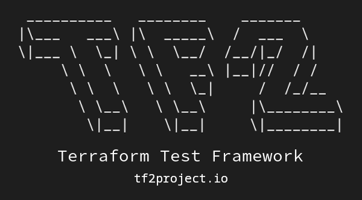

# Terraform Test Framework

  

Unified Test Framework to test Terraform codes and Terraform-provisioned infrastructures.

<strong>The first release, v0.1.0 (Shadowman) is now available.</strong>

  
  
  
  
  

---

**Documentation:** <a href="https://tf2project.io" target="_blank">https://tf2project.io</a>

**Source Code:** <a href="https://github.com/tf2project/tf2project" target="_blank">https://github.com/tf2project/tf2project</a>

---

**TF2** is a unified test framework to test Terraform codes and Terraform-provisioned infrastructures. With TF2, you can implement PaC(**Policy as Code**), **Compliance** tests, e2e(**End to End**) tests, and all other tests just in a unified framework.

### History

This idea crossed my mind when I was managing a big DevOps team that was working on various Terraform codes, and they were developing many Terraform codes and modules for several projects together. As a manager and a person who was responsible for accepting merge requests, I had to review their codes, and in some cases, I had to test them. Big team! Big problem! Reviewing more than 500 lines of codes a day and testing them had turned into my nightmare. Some problems that I faced with them are:

  1. Implementing Policy-as-Code while we have not got TFC/TFE to use Sentinel.
  2. Implementing e2e tests to test real infrastructures after deploying Terraform codes.
  3. Implementing standard rules for developing Terraform codes.

The thing is, it doesn't matter how many engineers you have in your team. If you want to implement policies, test your codes, and your infrastructures, and deliver better and more reliable Terraform codes, you should use Terraform Test Framework.

### Philosophy

  - Implement a unified framework to implement all Terraform test needs.
  - Implement a standard path to integrate Terraform tests into CI/CD pipelines.
  - Implement a DevOps-friendly framework for all DevOps engineers.

### Features

TF2 is under development, and many features will be added soon. Now the following features are implemented and can be used in production:

  - [x] Implementing Compliance tests and Policy as Code (Before deployment)
  - [x] Implementing End to End tests (After deployment)

### Integrations

TF2 is fully compatible and can be integrated with:

  - [x] Terraform Open-source, Terraform Cloud, Terraform Enterprise
  - [x] CI/CD systems like Jenkins CI, Gitlab CI, GitHub Actions

### Comparison

##### TF2 vs. Sentinel

Terraform Cloud and Terraform Enterprise come with a Policy-as-Code tool called **Sentinel**. Sentinel uses its programming language, and you should learn a new language to implement your tests. Of course, just policy as code. Moreover, none of them provides a solution to implement e2e(End to End) tests. With TF2, you can write both with the most DevOps engineers-friendly programming language, Python. TF2 is also available for Terraform open-source users.

| Service              | **TF2**            | TFO | TFC                | TFE                |
|:--------------------:|:------------------:|:---:|:------------------:|:------------------:|
| **Policy-as-Code**   | :white_check_mark: | :x: | :white_check_mark: | :white_check_mark: |
| **End-to-End Tests** | :white_check_mark: | :x: | :x:                | :x:                |

##### TF2 vs. Terratest

Terratest is a good tool by Gruntwork which allows you to implement e2e tests, but it doesn't provide any Policy-as-Code solution. To write your tests with Terratest, you should know how to write Go applications. TF2 makes the test world for DevOps engineers really easy. You can write your PaC and e2e tests in Python, DevOps engineers' lovely language.

| Service              | **TF2**            | Terratest          |
|:--------------------:|:------------------:|:------------------:|
| **Policy-as-Code**   | :white_check_mark: | :x:                |
| **End-to-End Tests** | :white_check_mark: | :white_check_mark: |

##### TF2 vs. Terraform-compliance

It's a cool tool to implement Policy as Code in a BDD(Behaviour Driven Development) language. It's really a lovely tool, but it doesn't support e2e tests, and it's not expandable like TF2. TF2 opens your hands to implement everything you need.

| Service              | **TF2**            | terraform-compliance |
|:--------------------:|:------------------:|:--------------------:|
| **Policy-as-Code**   | :white_check_mark: | :white_check_mark:   |
| **End-to-End Tests** | :white_check_mark: | :x:                  |

## Requirements

The **TF2 core** doesn't have any external or third-party requirements, and we will keep this approach as the main development policy to reduce the attack surface. This policy is created because you run the TF2 in your critical environments, CI/CD systems, and cloud/on-premises infrastructures, and we want to keep you completely secure.

The TF2 core is just using standard and official Python libraries.

## Installation

  pip install tf2project
  

## License

This project is licensed under the terms of the Apache 2.0 license.

*[TF2]: Terraform Test Framework
*[TFO]: Terraform Open-source
*[TFC]: Terraform Cloud
*[TFE]: Terraform Enterprise
